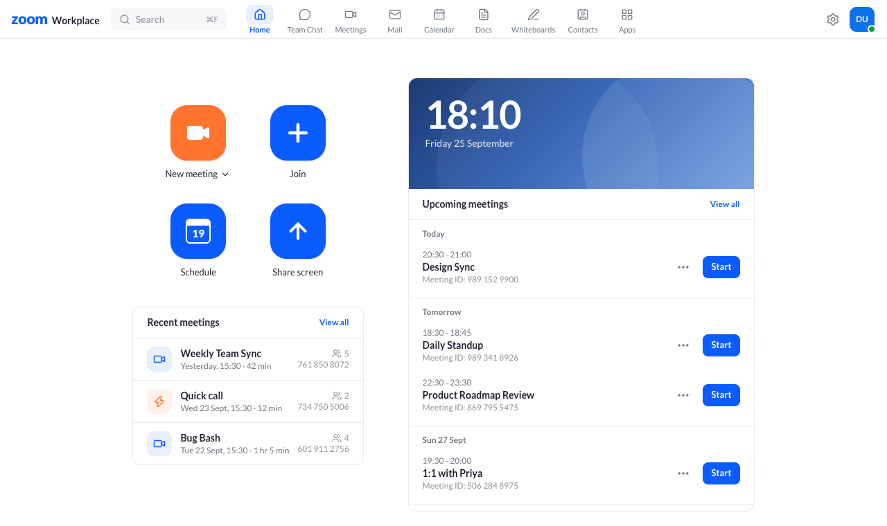
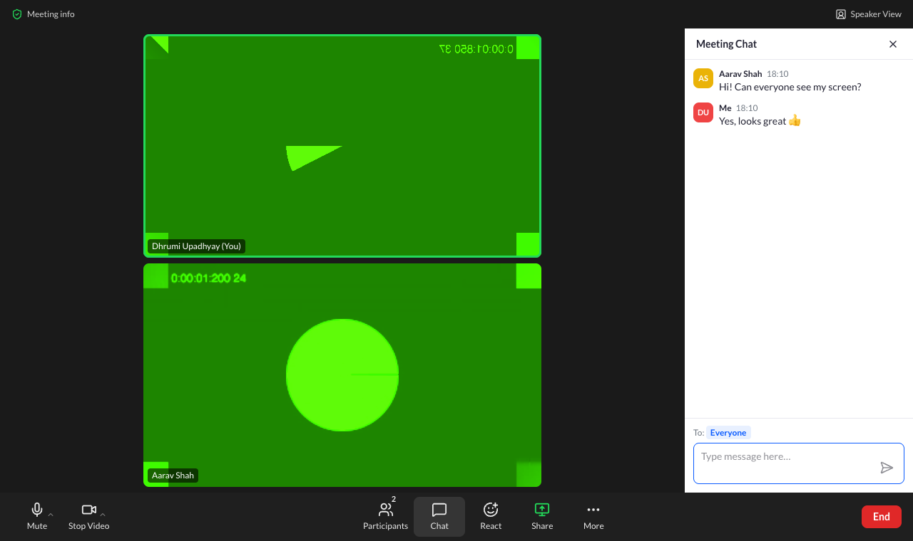
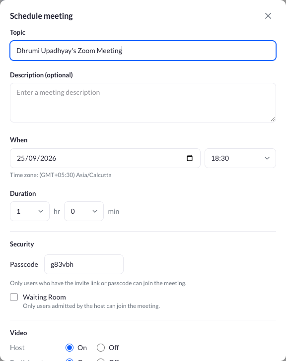
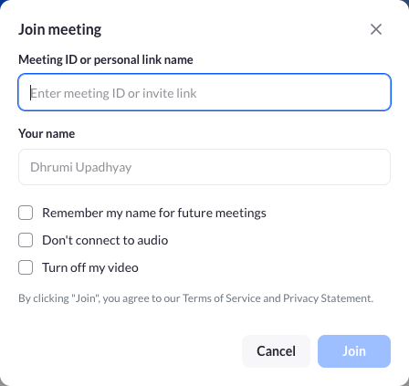
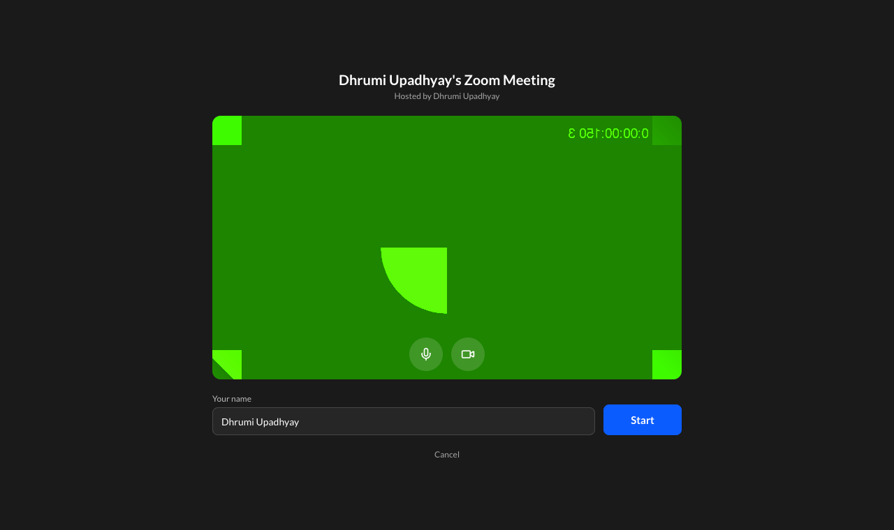
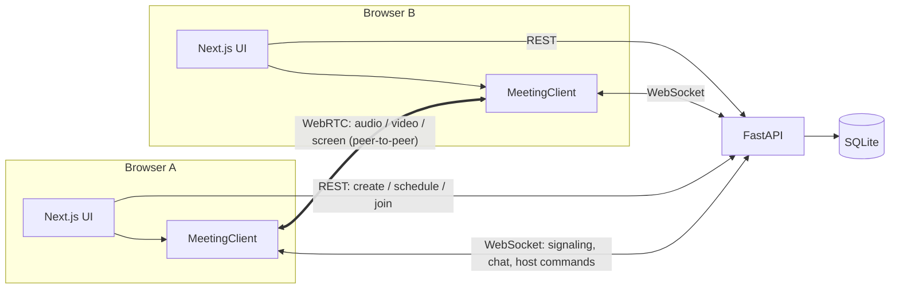
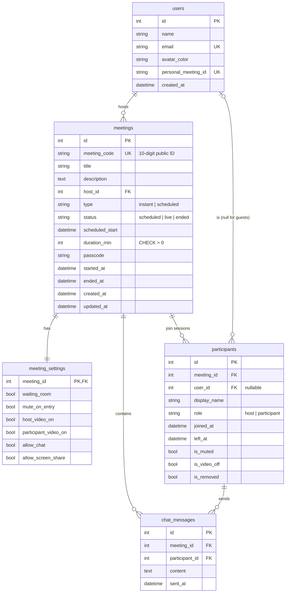

# Zoom Clone: Video Conferencing Platform

A working clone of the Zoom Workplace web app. You can start instant meetings, join by Meeting ID or invite link, schedule meetings, and hold **real video calls** in the browser with audio, video, screen sharing, chat, reactions, a waiting room and host controls.

- **Live demo:** _add your Vercel URL here_
- **API docs (Swagger):** _add your Render URL here_/docs

| Home | Meeting (chat) |
|---|---|
|  |  |

| Schedule | Join | Video preview | Participants + host controls |
|---|---|---|---|
|  |  |  |  |

> The green video in the screenshots is Chrome's built-in fake camera, used by the automated tests.

---

## Features

### Core (required)
| Feature | What it does |
|---|---|
| **Landing dashboard** | Zoom Workplace top bar (tabs, search, settings, profile menu), the four action tiles (**New meeting**, **Join**, **Schedule**, **Share screen**), a live clock card, **Upcoming meetings** grouped by day, and **Recent meetings** |
| **Instant meeting** | One click creates a meeting with a unique 10-digit Meeting ID, a passcode and a shareable invite link, then opens the room as host. The ⌄ menu has "Start with video" |
| **Join meeting** | Accepts a Meeting ID (`123 456 7890`, with or without spaces) **or** a pasted invite link. Asks for a display name ("Remember my name", "Don't connect to audio", "Turn off my video"), checks the meeting exists, hasn't ended and the passcode is right, and asks for the passcode if needed |
| **Schedule meeting** | Topic, description, date and time picker (15-minute steps, local time zone shown), duration, passcode, waiting room, host/participant video, mute on entry, chat and screen-share permissions. It generates the invite link, saves to the database, shows a details view with **Copy invitation**, and the meeting appears under Upcoming. Meetings can be **edited** and **deleted** |

### The meeting itself
- **Real video and audio** between browsers (WebRTC), with a **camera preview** before joining
- **Gallery view** (auto-sized 16:9 grid) and **Speaker view**, with a green **active-speaker** border
- **Screen sharing** (one presenter at a time, like Zoom) with the "You are screen sharing / Stop Share" bar
- **Chat** with an unread badge, **reactions** (👏 👍 ❤️ 😂 😮 🎉) and **raise hand**
- **Meeting info** (shield icon): ID, host, passcode, copyable invite link
- Keyboard shortcuts: **Alt+A** mute/unmute, **Alt+V** start/stop video

### Bonus
- **Host controls:** Mute All, mute one person, Ask to Unmute (hosts can't force a mic on, same as Zoom), Remove participant, **End meeting for all**
- **Waiting room:** guests wait until the host clicks **Admit** / **Admit all** / **Remove**
- **Responsive:** desktop, tablet and phone. On phones the tabs move to a bottom bar, like Zoom's mobile app, and the toolbar shows icons only
- Login/Signup was **not** built: the brief says to assume a default signed-in user

---

## Tech stack

| Layer | Technology |
|---|---|
| Frontend | **Next.js 16** (App Router), React 19, TypeScript, **Tailwind CSS v4**, SWR (data fetching), lucide-react (icons) |
| Backend | **Python + FastAPI**, SQLAlchemy 2.0 (ORM), Pydantic v2 (validation), Uvicorn |
| Database | **SQLite** |
| Real-time | **WebSockets** (FastAPI) for signaling, chat and host commands; **WebRTC** (browser-to-browser) for audio, video and screen share |
| Tests | Headless Chrome browser tests with puppeteer-core (`e2e/`) |
| Hosting | Vercel (frontend) + Render (backend) |

---

## Architecture



- **REST** handles everything stored: meetings, joining (creates a `participants` row), lists for the dashboard.
- **WebSocket** (`/ws/meetings/{code}?participant_id=…`) is the live channel. The server relays WebRTC offers/answers/ICE candidates, broadcasts chat, mic/camera state, reactions and screen-share state, and carries out host commands.
- **WebRTC mesh:** every participant connects directly to every other participant, and the media never passes through the server. Each connection has **three fixed slots** (microphone, camera, screen), so turning the camera or screen share on/off only swaps a track (`replaceTrack`) with no renegotiation.
- The frontend meeting engine (`frontend/lib/meeting/`) is **plain TypeScript classes** (`LocalMedia`, `Peer`, `MeetingClient`, `SpeakingDetector`), kept separate from React. Components subscribe to them through a small `useStore` hook.

---

## Database design



**Design decisions**
- **`participants` is one row per join session**, not per person. Guests don't need an account (`user_id` is nullable), and rejoining creates a new row, so each row keeps accurate join/leave times. "Recent meetings" and participant counts come from these rows.
- **`meeting_settings` is a separate 1:1 table** (its primary key is also the foreign key), so meeting options can grow without widening `meetings`.
- **`meeting_code` is separate from `id`:** the internal id never leaks into URLs, and codes are checked for collisions against both meetings and Personal Meeting IDs.
- **Enums are stored as readable strings** with CHECK constraints (`native_enum=False`), since SQLite has no enum type.
- **Integrity:** foreign keys are enforced (SQLite needs `PRAGMA foreign_keys=ON`, set on every connection). Deleting a meeting cascades to its settings, participants and messages; deleting a user sets `participants.user_id` to NULL.
- **Indexes** match the actual queries: `(host_id, status, scheduled_start)` for the dashboard, `(meeting_id, left_at)` for "who's in the meeting", `(meeting_id, sent_at)` for chat history.
- **Times are stored in UTC** and sent with a `Z` suffix; the browser shows them in the viewer's time zone.
- **Seed data** (`backend/app/seed.py`): a default user, 5 colleagues, 6 upcoming meetings (dated relative to "now"), and 5 past meetings with participants and chat. It runs automatically on first start.

---

## API

Interactive docs: `http://127.0.0.1:8000/docs`

| Method | Path | Purpose |
|---|---|---|
| GET | `/api/users/me` | The signed-in (default) user |
| GET | `/api/meetings/upcoming` | Live meetings first, then scheduled ones that haven't finished |
| GET | `/api/meetings/recent` | Ended meetings, newest first |
| POST | `/api/meetings/instant` | Create and start an instant meeting |
| POST | `/api/meetings` | Schedule a meeting |
| GET | `/api/meetings/{code}` | Public info (no passcode), used to check a Meeting ID |
| GET | `/api/meetings/{code}/details` | Owner view with passcode and invite link |
| PATCH / DELETE | `/api/meetings/{code}` | Edit / delete a scheduled meeting |
| POST | `/api/meetings/{code}/verify` | Check "exists, not ended, passcode OK" without joining |
| POST | `/api/meetings/{code}/join` | Join (creates a participant) |
| POST | `/api/meetings/{code}/leave` | Leave (the last one out ends the meeting) |
| POST | `/api/meetings/{code}/end` | Host: end for everyone |
| GET | `/api/meetings/{code}/participants` | People currently in the meeting |

Errors have one shape, `{"code": "wrong_passcode", "detail": "Wrong passcode. Please try again."}`, and the frontend switches on `code`.

WebSocket message types are documented at the top of `backend/app/routers/ws.py` and in `frontend/lib/meeting/types.ts`.

---

## Project structure

```
backend/
  app/
    main.py            FastAPI app, CORS, startup (create tables + seed)
    config.py          settings from environment variables
    database.py        engine, session, SQLite foreign keys
    models.py          SQLAlchemy models (the schema)
    schemas.py         Pydantic request/response models
    seed.py            sample data (python -m app.seed --reset)
    routers/           users.py, meetings.py (REST), ws.py (WebSocket)
    services/          meetings.py, participants.py, codes.py (business logic)
    realtime/          manager.py (rooms in memory), session.py, handlers.py (one handler per message type)
frontend/
  app/                 routes: (main)/ dashboard, meetings, settings · meeting/[code] · j/[code] (invite links)
  components/
    layout/            TopNav, NavTabs, ProfileMenu
    dashboard/         ActionTiles, ClockHero, Upcoming/Recent lists, MeetingsTabs
    meetings/          JoinForm, JoinMeetingDialog, ScheduleMeetingDialog, InviteLanding
    meeting/           PreJoinScreen, MeetingRoom, VideoStage, VideoTile, Toolbar, Chat/Participants panels, WaitingRoom
    ui/                Button, Modal, Field, Toast, DropdownMenu, Avatar…
  lib/
    api.ts, types.ts   typed REST client
    meeting/           LocalMedia, Peer, MeetingClient, SpeakingDetector (WebRTC engine)
  hooks/               useStartMeeting, useJoinIntent, useGalleryLayout, useDisposable…
e2e/                   browser tests
render.yaml            Render deployment blueprint
```

---

## Running locally

**Requirements:** Python 3.9+ and Node.js 20+ (Google Chrome is needed only for the e2e tests).

**1. Backend** (terminal 1)
```bash
cd backend
python3 -m venv .venv
source .venv/bin/activate            # Windows: .venv\Scripts\activate
pip install -r requirements.txt
uvicorn app.main:app --reload        # http://127.0.0.1:8000  (docs at /docs)
```
The SQLite database (`backend/zoom_clone.db`) is created and seeded on first start. To reset it: `python -m app.seed --reset`.

**2. Frontend** (terminal 2)
```bash
cd frontend
cp .env.local.example .env.local     # NEXT_PUBLIC_API_URL=http://127.0.0.1:8000
npm install
npm run dev                          # http://localhost:3000
```

**3. Try a call on one computer:** click **New meeting** → **Start**, copy the invite link from the shield icon, and open it in an **Incognito window**. Use headphones to avoid echo.

### Browser tests
With both servers running on a **fresh** database:
```bash
cd e2e && npm install && npm run all
```
- `flows.mjs`: join validation (bad ID, passcode step, wrong passcode), scheduling, invite links, instant meetings
- `meeting.mjs`: two browsers: video/audio both ways, mute, camera toggle, reactions, screen share, end for all
- `host-controls.mjs`: three browsers: waiting room admit/remove, chat both ways, mute, ask to unmute, mute all, remove

---

## Deployment

**Backend → Render**
1. Push this repo to GitHub.
2. In Render: **New → Blueprint**, pick the repo. `render.yaml` creates the `zoom-clone-api` web service.
3. Set `FRONTEND_URL` to your Vercel URL (for example `https://zoom-clone.vercel.app`). It's used for invite links and CORS.

**Frontend → Vercel**
1. In Vercel: **Add New → Project**, import the repo, and set **Root Directory** to `frontend`.
2. Add the environment variable `NEXT_PUBLIC_API_URL` = your Render URL (for example `https://zoom-clone-api.onrender.com`).
3. Deploy. The WebSocket address is derived automatically (`https` → `wss`).

**Calls across different networks (optional TURN):** STUN (the default) works on most home and office networks. For strict networks (some mobile carriers, corporate firewalls), add a TURN server by setting `NEXT_PUBLIC_ICE_SERVERS` in Vercel to a JSON list, for example from a free TURN provider:
```json
[{"urls":"stun:stun.l.google.com:19302"},{"urls":"turn:<host>:3478","username":"<user>","credential":"<password>"}]
```

---

## Assumptions and limitations

- **No authentication:** as the brief allows, every request acts as the seeded default user. Because of that, "host" means **started from the dashboard** (New meeting / Start). Anyone opening an invite link or typing a Meeting ID joins as a guest and needs the passcode (invite links include it, like Zoom's `?pwd=`).
- **SQLite on Render's free plan is temporary:** the disk resets on redeploy or restart, and the app re-seeds itself on startup. Upcoming seed meetings are dated relative to startup, so the dashboard always has data. For permanent data, attach a Render disk or point `DATABASE_URL` at another database.
- **Render free instances sleep** after inactivity, so the first request can take ~30–60 s.
- **Mesh WebRTC** suits small meetings (about 2–6 people). Larger meetings would need a media server (SFU), which is what Zoom itself uses.
- **Live meeting state** (who is connected, waiting room, raised hands, screen sharer) is kept **in the server's memory**, so the backend runs as **one worker**. Scaling out would move this into Redis pub/sub.
- **Camera and mic require HTTPS or localhost** (a browser rule). To test from a phone, use the deployed HTTPS site.
- Not built: recording, breakout rooms, private chat, virtual backgrounds, the audio/video device picker (the toolbar ⌃ carets are visual only), and the Team Chat / Mail / Calendar / Docs / Whiteboards / Contacts / Apps tabs, which are placeholders for visual parity.
- The "zoom" wordmark is drawn with text, not Zoom's trademarked logo.
