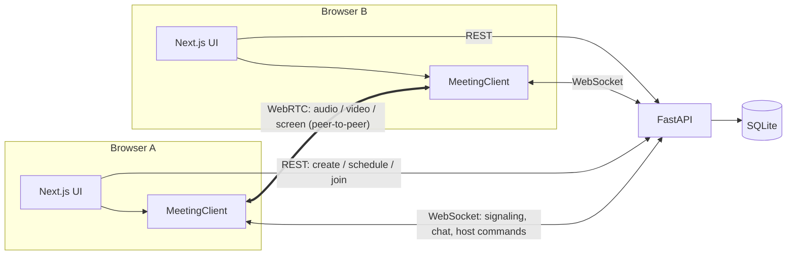
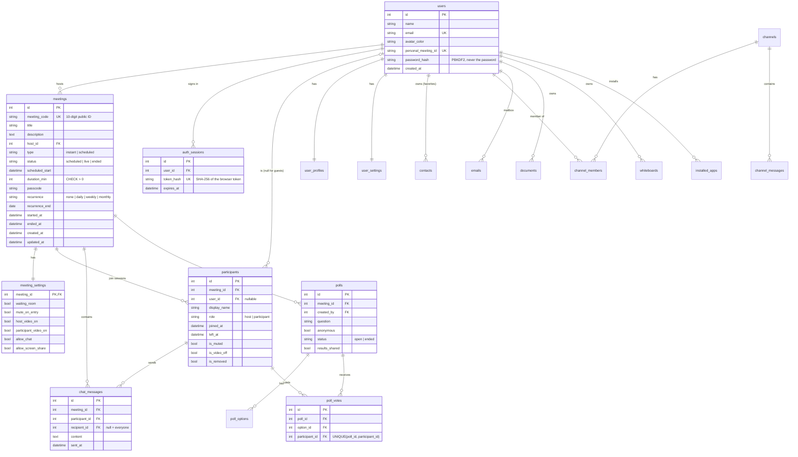

# Zoom Clone: Video Conferencing Platform

A working clone of the Zoom Workplace web app. You can start instant meetings, join by Meeting ID or invite link, schedule meetings, and hold **real video calls** in the browser with audio, video, screen sharing, chat, reactions, a waiting room and host controls.

- **Live demo:** https://zoom-clone-eta-hazel.vercel.app
- **Backend API docs (Swagger):** https://zoom-clone-api-8uvt.onrender.com/docs
- **Source code:** https://github.com/dhrumi2004/zoom-clone

> **Sign in:** create an account with **Sign up free**, or use a demo account: `dhrumi@zoomclone.dev`, `aarav@zoomclone.dev` or `priya@zoomclone.dev`, password **`zoom1234`**. The sign-in page has one-click buttons for them. To try a meeting with several people, sign in as different accounts in different browsers (or a normal + an incognito window).
>
> The backend runs on Render's free plan: if it was idle, the first page load can take up to a minute.

| Home | Meeting (chat) |
|---|---|
|  |  |

| Schedule | Join | Video preview | Participants + host controls |
|---|---|---|---|
|  |  |  |  |

> The green video in the screenshots is Chrome's built-in fake camera, used by the automated tests.

---

## Features

### Core (required)
| Feature | What it does |
|---|---|
| **Landing dashboard** | Zoom Workplace top bar (tabs, search, settings, profile menu), the four action tiles (**New meeting**, **Join**, **Schedule**, **Share screen**), a live clock card, **Upcoming meetings** grouped by day, and **Recent meetings** |
| **Instant meeting** | One click creates a meeting with a unique 10-digit Meeting ID, a passcode and a shareable invite link, then opens the room as host. The ⌄ menu has "Start with video" |
| **Join meeting** | Accepts a Meeting ID (`123 456 7890`, with or without spaces) **or** a pasted invite link. Asks for a display name ("Remember my name", "Don't connect to audio", "Turn off my video"), checks the meeting exists, hasn't ended and the passcode is right, and asks for the passcode if needed |
| **Schedule meeting** | Topic, description, date and time picker (15-minute steps, local time zone shown), duration, passcode, waiting room, host/participant video, mute on entry, chat and screen-share permissions. It generates the invite link, saves to the database, shows a details view with **Copy invitation**, and the meeting appears under Upcoming. Meetings can be **edited** and **deleted** |

### The meeting itself
- **Real video and audio** between browsers (WebRTC), with a **camera preview** before joining
- **Gallery view** (auto-sized 16:9 grid) and **Speaker view**, with a green **active-speaker** border
- **Screen sharing** (one presenter at a time, like Zoom) with the "You are screen sharing / Stop Share" bar
- **Chat** with an unread badge, **reactions** (👏 👍 ❤️ 😂 😮 🎉) and **raise hand**
- **Meeting info** (shield icon): ID, host, passcode, copyable invite link
- Keyboard shortcuts: **Alt+A** mute/unmute, **Alt+V** start/stop video

### Zoom Workplace sections (top bar)
Every tab in the top bar is a working, database-backed section:

| Tab | What it does |
|---|---|
| **Team Chat** | Channels and direct messages with colleagues, create channels, start DMs, unread badges, links, and a **Meet** button that starts a meeting and posts the invite in the chat |
| **Mail** | Inbox / Starred / Sent / Trash, reading pane, compose and reply, star, move to Trash and restore, delete forever, search |
| **Calendar** | Week and day views of your meetings with overlap handling and a "now" line. Click an empty slot to schedule there; click a meeting to Start, Copy invitation, Edit or Delete |
| **Docs** | Documents with a formatting toolbar (headings, bold, italic, underline, lists, quotes, undo/redo) and autosave. HTML is sanitized on the server |
| **Whiteboards** | Drawing canvas with pen, highlighter, eraser, 8 colors, 4 sizes, undo/redo, clear, PNG download, and autosave |
| **Contacts** | Directory with search, starred contacts, and a profile card with **Meet**, **Chat** and **Email** actions |
| **Apps** | Marketplace with categories and search; add/remove apps ("My apps") |
| **Settings** | Profile (name, avatar color, job details), meeting defaults (start with video, mute on join, default duration, waiting room, mute on entry), camera/microphone selection with live preview and mic level, keyboard shortcuts |

### More Zoom meeting features
| Feature | How it works here |
|---|---|
| **Security menu** (host/co-host) | Lock meeting, enable waiting room, and allow participants to share screen / chat / rename / unmute themselves |
| **Co-host** | The host can make anyone a co-host; co-hosts get host controls except ending the meeting or making co-hosts |
| **Pin / Spotlight** | Pin a video just for you, or Spotlight it for everyone (from the "…" menu on any video tile) |
| **Rename** | Rename yourself (if allowed) or, as host, anyone |
| **Host video controls** | Stop someone's video, or ask them to start it |
| **Lower all hands** | One click in the Participants panel |
| **Private chat** | "To:" picker in Meeting Chat; private messages are marked (Direct Message) |
| **Polls** | Launch a poll, see live results (with voter names unless anonymous), end it, share results with everyone. Stored in the database |
| **Breakout rooms** | Create rooms, assign automatically or by hand, open them; each room is its own video call and chat. Hosts can visit rooms, move people, and close all rooms |
| **Record to this computer** | Records the meeting tab + your mic and downloads a .webm; everyone sees a red **Recording** indicator |
| **Live captions** | Speech-to-text of each person's voice (Chrome/Edge/Safari speech recognition), shown at the bottom for everyone |
| **Background blur** | MediaPipe person segmentation blurs everything but you, before the video is sent |
| **Device menus** | The ⌃ arrows next to Mute / Stop Video pick microphone, speaker and camera during the call |
| **Meeting timer, full screen, hide self view** | In the top bar and the More menu |
| **Personal Meeting ID** | "Use my PMI" under the New meeting arrow reuses your personal meeting room |
| **Recurring meetings** | Daily / weekly / monthly with an optional end date; one Meeting ID, shown on the calendar as occurrences |
| **Email invitation** | Opens Zoom Mail with the invitation filled in |

### Accounts (sign up / sign in)
- **Sign up** (name, email, password with live rules), **Sign in**, **Sign out**; every page and API requires sign-in
- Passwords are hashed with **PBKDF2-SHA256** (random salt, 200,000 iterations); sessions are random tokens stored **only as SHA-256 hashes** in `auth_sessions`, valid for 30 days, deleted on sign-out
- **Invite links while signed out** send you to Sign In (or Sign Up) and then **straight back to the meeting**
- **The meeting's owner is its host** however they open it; everyone else joins as a participant under their own account. The live connection checks your session, so nobody can take over another person's seat
- Each account has its own meetings, recent meetings (hosted **or attended**), settings, docs and whiteboards; **Mail and Team Chat reach other accounts**, and new accounts join #general

### Bonus
- **Host controls:** Mute All, mute one person, Ask to Unmute (hosts can't force a mic on, same as Zoom), Remove participant, **End meeting for all**
- **Waiting room:** guests wait until the host clicks **Admit** / **Admit all** / **Remove**
- **Responsive:** desktop, tablet and phone. On phones the tabs move to a bottom bar, like Zoom's mobile app, and the toolbar shows icons only
- **User authentication (Login/Signup)** is built as well (see Accounts above)

---

## Tech stack

| Layer | Technology |
|---|---|
| Frontend | **Next.js 16** (App Router), React 19, TypeScript, **Tailwind CSS v4**, SWR (data fetching), lucide-react (icons) |
| Backend | **Python + FastAPI**, SQLAlchemy 2.0 (ORM), Pydantic v2 (validation), Uvicorn |
| Database | **SQLite** |
| Real-time | **WebSockets** (FastAPI) for signaling, chat and host commands; **WebRTC** (browser-to-browser) for audio, video and screen share |
| Tests | Headless Chrome browser tests with puppeteer-core (`e2e/`) |
| Hosting | Vercel (frontend) + Render (backend) |

---

## Architecture



- **REST** handles everything stored: meetings, joining (creates a `participants` row), lists for the dashboard.
- **WebSocket** (`/ws/meetings/{code}?participant_id=…`) is the live channel. The server relays WebRTC offers/answers/ICE candidates, broadcasts chat, mic/camera state, reactions and screen-share state, and carries out host commands.
- **WebRTC mesh:** every participant connects directly to every other participant, and the media never passes through the server. Each connection has **three fixed slots** (microphone, camera, screen), so turning the camera or screen share on/off only swaps a track (`replaceTrack`) with no renegotiation.
- The frontend meeting engine (`frontend/lib/meeting/`) is **plain TypeScript classes** (`LocalMedia`, `Peer`, `MeetingClient`, `SpeakingDetector`), kept separate from React. Components subscribe to them through a small `useStore` hook.

---

## Database design



The workspace tables (details in `backend/app/models/workspace.py`):
- `user_profiles` / `user_settings`: 1:1 with users (primary key = user_id), so `users` stays small
- `contacts`: owner → contact with `is_favorite`; UNIQUE(owner_id, contact_id) and CHECK(owner ≠ contact)
- `channels` (type channel | direct), `channel_members` (composite primary key; `last_read_at` drives unread counts), `channel_messages` (index on channel_id, sent_at). A DM is simply a 2-member channel
- `emails`: one row per mailbox copy, with `folder` (inbox | sent | trash) plus `original_folder` so Restore knows where to go
- `documents` (sanitized HTML), `whiteboards` (strokes as JSON), `installed_apps` (composite primary key user_id + app_key; the catalog is static)

**Design decisions**
- **`participants` is one row per join session**, not per person. Guests don't need an account (`user_id` is nullable), and rejoining creates a new row, so each row keeps accurate join/leave times. "Recent meetings" and participant counts come from these rows.
- **`meeting_settings` is a separate 1:1 table** (its primary key is also the foreign key), so meeting options can grow without widening `meetings`.
- **`meeting_code` is separate from `id`:** the internal id never leaks into URLs, and codes are checked for collisions against both meetings and Personal Meeting IDs.
- **Enums are stored as readable strings** with CHECK constraints (`native_enum=False`), since SQLite has no enum type.
- **Integrity:** foreign keys are enforced (SQLite needs `PRAGMA foreign_keys=ON`, set on every connection). Deleting a meeting cascades to its settings, participants and messages; deleting a user sets `participants.user_id` to NULL.
- **Indexes** match the actual queries: `(host_id, status, scheduled_start)` for the dashboard, `(meeting_id, left_at)` for "who's in the meeting", `(meeting_id, sent_at)` for chat history.
- **Times are stored in UTC** and sent with a `Z` suffix; the browser shows them in the viewer's time zone.
- **Schema upgrades:** `create_all` only creates missing tables, so `backend/app/migrations.py` adds columns introduced later (for example `recurrence`, `recipient_id`) with `ALTER TABLE` on startup. Existing databases keep their data.
- **Live-session state stays in memory, not the database:** who is connected, which breakout room they're in, co-hosts, lock, spotlight and recording. It only matters while the meeting runs.
- **Seed data** (`backend/app/seed.py`): a default user, 5 colleagues, 6 upcoming meetings (dated relative to "now"), and 5 past meetings with participants and chat. It runs automatically on first start.

---

## API

Interactive docs: `http://127.0.0.1:8000/docs`

All endpoints except `/health`, `POST /api/auth/signup|login` and `GET /api/meetings/{code}` (the invite page's title) need `Authorization: Bearer <token>`.

| Method | Path | Purpose |
|---|---|---|
| POST | `/api/auth/signup` · `/api/auth/login` | Create an account / sign in → `{token, user}` |
| POST | `/api/auth/logout` | End this session |
| GET | `/api/users/me` | The signed-in user |
| GET | `/api/meetings/upcoming` | Live meetings first, then scheduled ones that haven't finished |
| GET | `/api/meetings/recent` | Ended meetings, newest first |
| POST | `/api/meetings/instant` | Create and start an instant meeting |
| POST | `/api/meetings` | Schedule a meeting |
| GET | `/api/meetings/{code}` | Public info (no passcode), used to check a Meeting ID |
| GET | `/api/meetings/{code}/details` | Owner view with passcode and invite link |
| PATCH / DELETE | `/api/meetings/{code}` | Edit / delete a scheduled meeting |
| POST | `/api/meetings/{code}/verify` | Check "exists, not ended, passcode OK" without joining |
| POST | `/api/meetings/{code}/join` | Join (creates a participant) |
| POST | `/api/meetings/{code}/leave` | Leave (the last one out ends the meeting) |
| POST | `/api/meetings/{code}/end` | Host: end for everyone |
| GET | `/api/meetings/{code}/participants` | People currently in the meeting |
| GET | `/api/meetings/calendar?start=&end=` | Your meetings in a date range (Calendar) |
| PATCH | `/api/users/me` · GET `/api/users/me/profile` | Update name, avatar color and profile details |
| GET / PATCH | `/api/users/me/settings` | Personal meeting defaults |
| GET | `/api/users/me/badges` | Unread counts for Team Chat and Mail |
| GET / PATCH | `/api/contacts`, `/api/contacts/{user_id}` | Directory; star / unstar |
| GET / POST | `/api/chat/channels` · POST `/api/chat/direct` | List / create channels; open or create a DM |
| GET / POST | `/api/chat/channels/{id}/messages` | Read (marks as read) / send |
| GET / POST / PATCH / DELETE | `/api/mail`, `/api/mail/{id}` | Folders + search, send, star/read/trash/restore, delete forever |
| CRUD | `/api/docs`, `/api/whiteboards` | Documents and whiteboards |
| GET / PUT / DELETE | `/api/apps`, `/api/apps/{key}` | Marketplace; add / remove |

Errors have one shape, `{"code": "wrong_passcode", "detail": "Wrong passcode. Please try again."}`, and the frontend switches on `code`.

WebSocket message types are documented at the top of `backend/app/routers/ws.py` and in `frontend/lib/meeting/types.ts`.

---

## Project structure

```
backend/
  app/
    main.py            FastAPI app, CORS, startup (create tables + seed)
    config.py          settings from environment variables
    database.py        engine, session, SQLite foreign keys
    models/            SQLAlchemy models: core.py (meetings), workspace.py (chat, mail, docs...)
    schemas/           Pydantic request/response models (core.py, workspace.py)
    seed.py            sample data (python -m app.seed --reset); seed_workspace.py for the workspace sections
    routers/           meetings, users, contacts, team_chat, mail, documents, apps (REST), ws.py (WebSocket)
    services/          business logic, one module per feature
    realtime/          manager.py (rooms in memory), session.py, handlers.py (one handler per message type)
frontend/
  app/                 routes: (main)/ dashboard, meetings, chat, mail, calendar, docs, whiteboards, contacts, apps, settings · meeting/[code] · j/[code]
  components/
    layout/            TopNav, NavTabs, ProfileMenu
    dashboard/         ActionTiles, ClockHero, Upcoming/Recent lists, MeetingsTabs
    meetings/          JoinForm, JoinMeetingDialog, ScheduleMeetingDialog, InviteLanding
    meeting/           PreJoinScreen, MeetingRoom, VideoStage, VideoTile, Toolbar, Chat/Participants panels, WaitingRoom
    chat/ mail/ calendar/ docs/ whiteboard/ contacts/ apps/ settings/   one folder per workspace section
    ui/                Button, Modal, Field, Toast, DropdownMenu, Avatar…
  lib/
    api.ts, types.ts   typed REST client
    meeting/           LocalMedia, Peer, MeetingClient, SpeakingDetector (WebRTC engine)
  hooks/               useStartMeeting, useJoinIntent, useGalleryLayout, useDisposable…
e2e/                   browser tests
render.yaml            Render deployment blueprint
```

---

## Running locally

**Requirements:** Python 3.9+ and Node.js 20+ (Google Chrome is needed only for the e2e tests).

**Quick start (macOS/Linux):** `./start.sh` installs what's missing and runs both servers. Open http://localhost:3000.

Or step by step:

**1. Backend** (terminal 1)
```bash
cd backend
python3 -m venv .venv
source .venv/bin/activate            # Windows: .venv\Scripts\activate
pip install -r requirements.txt
uvicorn app.main:app --reload        # http://127.0.0.1:8000  (docs at /docs)
```
The SQLite database (`backend/zoom_clone.db`) is created and seeded on first start. To reset it: `python -m app.seed --reset`.

**2. Frontend** (terminal 2)
```bash
cd frontend
cp .env.local.example .env.local     # NEXT_PUBLIC_API_URL=http://127.0.0.1:8000
npm install
npm run dev                          # http://localhost:3000
```

**3. Try a call on one computer:** click **New meeting** → **Start**, copy the invite link from the shield icon, and open it in an **Incognito window**. Use headphones to avoid echo.

### Browser tests
With both servers running on a **fresh** database (or against a deployment with `APP_URL=… API_URL=… npm run all`):
```bash
cd e2e && npm install && npm run all   # runs every file with a time limit and cleans up its browsers
```
- `flows.mjs`: join validation (bad ID, passcode step, wrong passcode), scheduling, invite links, instant meetings
- `meeting.mjs`: two browsers (two accounts): video/audio both ways, mute, camera toggle, reactions, screen share, end for all
- `host-controls.mjs`: three browsers (three accounts): waiting room admit/remove, chat both ways, mute, ask to unmute, mute all, remove
- `meeting-extras.mjs`: co-host, rename, pin/spotlight, security (lock, rename/unmute permissions), private chat, stop/ask video, polls, breakout rooms, hide self view, device menus, background blur, recording, PMI
- `auth-flow.mjs`: sign-up validation, sign in/out, protected pages, then **3 accounts**: a new user schedules a meeting, a signed-out person opens the invite link → signs up → lands back in the meeting, a demo account joins, and all three share one call (host controls + chat across accounts)
- `workspace.mjs`: every top-bar section: Team Chat, Mail, Calendar, Docs (autosave + reload), Whiteboards (draw, save, undo), Contacts, Apps, Settings (profile, defaults, camera preview)

---

## Deployment

**Backend → Render**
1. Push this repo to GitHub.
2. In Render: **New → Blueprint**, pick the repo. `render.yaml` creates the `zoom-clone-api` web service.
3. Set `FRONTEND_URL` to your Vercel URL (for example `https://zoom-clone.vercel.app`). It's used for invite links and CORS.

**Frontend → Vercel**
1. In Vercel: **Add New → Project**, import the repo, and set **Root Directory** to `frontend`. (Deployed here as a project linked to this GitHub repo, so every push to `main` redeploys.)
2. Add the environment variable `NEXT_PUBLIC_API_URL` = your Render URL (for example `https://zoom-clone-api.onrender.com`).
3. Deploy. The WebSocket address is derived automatically (`https` → `wss`).

**Calls across different networks (optional TURN):** STUN (the default) works on most home and office networks. For strict networks (some mobile carriers, corporate firewalls), add a TURN server by setting `NEXT_PUBLIC_ICE_SERVERS` in Vercel to a JSON list, for example from a free TURN provider:
```json
[{"urls":"stun:stun.l.google.com:19302"},{"urls":"turn:<host>:3478","username":"<user>","credential":"<password>"}]
```

---

## Assumptions and limitations

- **Sign-in is required.** Demo accounts (password `zoom1234`) are seeded for reviewers. The host of a meeting is the account that created it; anyone else joins as a participant and needs the passcode (invite links include it, like Zoom's `?pwd=`). Guests can join a scheduled meeting before the host arrives (Zoom's "Allow participants to join anytime").
- **Session token in localStorage** (sent as a Bearer header) rather than a cookie, because the site (Vercel) and API (Render) are on different domains, where browsers block third-party cookies. There's no email verification or password reset (no email service); the demo accounts cover reviewing.
- **SQLite on Render's free plan is temporary:** the disk resets when the service restarts or redeploys, and the app re-seeds itself (demo accounts, sample data). A GitHub Action (`.github/workflows/keep-backend-awake.yml`) pings the backend every 10 minutes so it doesn't idle-restart, which keeps accounts created on the live site until the next deploy. For permanent data, attach a Render disk or point `DATABASE_URL` at another database.
- **Render free instances sleep** after inactivity, so the first request can take ~30–60 s.
- **Mesh WebRTC** suits small meetings (about 2–6 people). Larger meetings would need a media server (SFU), which is what Zoom itself uses.
- **Live meeting state** (who is connected, waiting room, raised hands, screen sharer) is kept **in the server's memory**, so the backend runs as **one worker**. Scaling out would move this into Redis pub/sub.
- **Camera and mic require HTTPS or localhost** (a browser rule). To test from a phone, use the deployed HTTPS site.
- **Team Chat and Mail work between accounts** in this app (seeded colleagues are demo accounts too). Team Chat refreshes every few seconds instead of using WebSockets. Mail stays inside the app (no SMTP): addresses without an account here only appear in your Sent folder.
- **Not possible in a browser clone:** phone dial-in, cloud recording on Zoom's servers, remote control of another computer, Zoom Rooms hardware. **Not built:** AI Companion (needs a paid AI service), webinars/events, virtual background images (blur is built), annotation on shared screens, file sharing in chat, and real-time co-editing of docs and whiteboards.
- **Recordings** are saved to your computer (Zoom's "Record to this computer"); choose "This tab" when the browser asks what to record.
- **Captions** transcribe each person in their own browser, so they work for people using Chrome, Edge or Safari (Firefox has no speech recognition).
- **Recurring meetings:** past sessions of a recurring meeting don't appear under Recent meetings (the meeting row moves on to its next occurrence).
- The "zoom" wordmark is drawn with text, not Zoom's trademarked logo.
